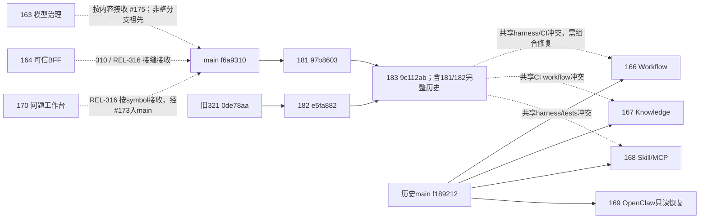

# S5-V023-ARCH-323 收口审计与主分支集成准备

2026-09-21；原323文档切片，G0只读核验/任务准备。沿用原计划、Registry、分支及Draft PR183；不是新Session、不是合并授权。完整可重复事实见 [审计清单](../evidence/s5/v0.2/s5-v023-arch-323/integration-audit.json)。外部原始回执根目录：`/Users/tristan/Documents/s5-v023-arch-323-acceptance/integration-audit`。所有状态均绑定以下快照，后续HEAD变化需重新核对受影响部分。

## 1. 实际断点与323收口矩阵

读回起点/本轮修改前本地HEAD和远端PR183均为`9c112ab9e5ff646ed773d1dbe5d1b01619313ff6`，tree `6c77fe9890dda582ae5eb4f72c0d89562bc334e7`，工作区干净。远端受保护main为`f6a931017dc4b68b7a92ffe0abaaf2819eec6cb7`，由fetch、GitHub branch API及ls-remote交叉核对。未修改原分支历史。

原隔离服务PID18803仍监听19436；HTTPS `/healthz` HTTP200 / application/json。启动后由服务写入的最新source receipt仍为`59224afeffec77d0eac0125753c0d278736c22b4`，tree `7a33ff22b06da26dd042dc086938fdbfe4b36056`。与9c112ab仅差原计划和Registry，backend子树相同。配置文件摘要及正式read55 configuration digest仍为`f592f2e2b55fce9c64b9b3d1fd7a919f21e452991859b9b572d1649170e73ca6`（connect5/read55/total60/cleanup≤2/output8192）；本轮未切服务、未重新签发、未迁移。启动回执+当前监听进程+代码差异/配置核对是运行候选证据，不把健康200单独等同全部业务验收。旧身份凭据已于09-21 02:34:34.697+08到期，未续发；此次健康及PG只读审计未借此调用业务API。

| 项目 | 已完成与证据 | 已知限制 / 待补项 |
| --- | --- | --- |
| 真实理解/必要补问/回答/纠正 | 原同一context的三次Kimi成功；PG turn parent链及case→纠正invocation→Problem关联核对 | 最初未派发AUTHORIZATION_PENDING记录仍保留；理解响应原文按既有CONTENT_NOT_RETAINED边界，不宣称PG保存全部对话内容 |
| 标准保存/显式激活 | 原Problem v1、CriteriaSet v1、criterion exact revision、ACTIVE aggregate v3保持 | 不为收口重复理解/保存/激活；草稿与正式对象不可混为一个持久聊天记录 |
| 自由规划 | planning.v3 / FREE，4阶段6任务；8000预算（10000作废）、排除试验项目、部分月比较限制、缺账单不虚构结论 | 成功前需人工补充引用/typed数据流规则；不是首次成功或自主模型可靠性证明；自然语言校验有限 |
| 页面确认/刷新/PG | Plan/Approval逐字段与上次读回相同；已有确认仅1 POST、刷新0 POST证据复用 | 本轮没有重复页面确认或真实演示；截图是功能证据，不是新设计基线 |
| 采购历史Plan | 原Plan/Approval和响应保留；旧固定任务契约不符合，业务目标覆盖人工评估另列 | 读取+校验合并、stable ID职责错位、人工复核替代报告；不能用于固定采购执行准入，必须正式successor后重确认 |
| UNKNOWN/用量 | 七条待决预留、16条已结算及历史摘要均与交付一致 | 未知费用不记零；估算不是供应商账单；本地worker回收不证明远端停止 |
| 资源就绪 | 当前成本2项需求、0匹配、2必要缺口；如实展示 | 精确资源、权限、实例、运行条件未齐；不是READY |
| 执行/业务验收 | Assignment / workflow_runs / task_runs / attempts均0 | 未执行成本分析、未产生实际账单归因/节约结果、未创建Criteria Evaluation或业务Outcome |
| 视觉/产品体验 | 历史有界接受保留；本轮只读图片/源码核验 | 当前输入区、裁切、状态、语言一致性未视觉验收；见第4节 |

### 1.1 对象关联（原始证据复用，本轮PG核对）

- Delegation `task-delegation:cd5da65e72bc027797cf17d161ae6004`；case/context `draft-context:3fd3c932341b631af5b5e80987d8ba87`，独立issuer `human:demo323-approver`，case digest `d0287f927e53925c01866331b9799c29ba952a918bce7c224b0ab395167d47a6`。
- 最初未派发invocation `draft-invocation:dc5281f0cb6acf5b77196cb50df4b162`仍AUTHORIZATION_PENDING；后继turn ordinal2→3→4链完整。必要补问 `draft-invocation:d992d561e8fe43c25ccaf104a4cee639`（NEEDS_CLARIFICATION，期间/账单周期和可提供的成本口径）；回答 `draft-invocation:8a91443c34f16e88138af8081df89e68`；纠正 `draft-invocation:a328c3e7946e51880006f25f342b6f35`。后两次DRAFT_READY，PG纠正版本9已关联正式Problem；预算8000与排除试验项目进入正式描述及标准。
- Problem `59a1d736-96d5-5060-8ae3-293d82b4b74b` / revision `:1`，digest `594d364f17e0ddc2a3fdb378d01cbc51886f395d40c25b3a39ed81036f0c6ad6`；CriteriaSet `48d112c8-6cd7-53b4-8eef-b8920e91b312`，digest `93f51f474d8daa0c8a0891f0ca25cee0f81e2b7c09cafb74a775571de2c6aa89`；criterion revision `f7494721-f0c8-56b0-b803-c4ca66a5919f`。
- 成功规划invocation `ac512acd-29a3-49f7-b757-e937378358eb` → Proposal/Plan `5ad74afd-a6bf-4b04-b395-34d18d01c3b6` v1 → Approval `367ae569-7d5b-4334-9349-f89be8b74daa`。Plan digest `b8944fd42a8b7764700f7c9fda7b9db4a1c4f681ad1b6f50641dc307d81c8f94`；确认2026-09-21 02:21:25.514033+08，独立于刷新时间。
- 四阶段：收集、核验汇总、分析建议、报告；六操作：READ_DATA→VALIDATE_DATA→SUMMARIZE→ANALYZE_DATA→RECOMMEND→RENDER_REPORT。内容是未来数据获取/分析计划，不是已有数据结果。
- 采购Plan `65acd64a-2338-43a2-bbc6-174440b90595` v1，Approval `1c08b6a7-eef0-46b9-b124-0a873f5e2f36`，digest `ce940419b496623c94e32f2ddae5add15e6fed5406a4c1ae618e172cdac0d3fb`。原计划§24.7不符合结论不被后续FREE策略追认。

**证据层级限制**：`cost-initial-formal-read.png`及`cost-correction-formal-read.png`是浏览器打开正式JSON读回的截图，不是完整对话页逐步视觉证据。`cost-criteria-page.png`、`cost-active-page.png`、`cost-real-confirmed-refreshed.png`才是相应产品页面。真实模型响应、同案持久关联、页面确认成立；不将上述不同证据拼成“全部阶段都在对话UI完成且已视觉验收”。本轮按要求不补跑演示，后续前端包需补UI层证据。

### 1.2 负债与结算

七条UNKNOWN（原六条加read55诊断新增一条）逐条保留：
`03220c83-e2cf-4f55-95ca-9d17790dd3ed`、`d10f945b-9bbb-4844-abb8-efff0645e8c8`、`583d0ad6-66aa-4f7c-a45f-5d860f7500e9`、`e39ae2fd-b1c2-4642-b395-8dce4da4a807`、`6a15744b-aabb-490e-915d-9c0fe6180ff6`、`61deac4b-1da1-4224-b5a9-e8de980ec121`、`6b846bbb-be11-4d1c-be72-5e06c0724569`。

| 范围 | 已计量结算 | input / output tokens | 估算USD | UNKNOWN预留USD |
| --- | --- | --- | --- | --- |
| read55诊断批次 | 5尝试中4条 | 15,532 / 7,519 | 0.274636 | 新增0.688128 |
| 成本累计 | 14调用记录中10条 | 21,827 / 9,865 | 0.371916 | 4条 / 2.752512 |
| 原双案例账本合计 | 16条 | 29,355 / 13,237 | 0.499580 | 7条 / 4.816896 |

本轮新模型调用=0、结算新增=0、预留释放=0。`323-live-audit.json`逐集合等值检查、`cost-persistent-lineage.json`及`real-demo/timeout-revision/integration-audit-pg.json`保存本轮只读结果；旧回执不覆盖。

## 2. 未合并PR：实际提交、内容与门禁

十项当前均OPEN/Draft；GitHub reviews数组均空、reviewDecision为空。文档中的Human有界接受与GitHub review approval不是同一事实。所有72个check的实际checkout已从Actions日志定位，checkout为head或其PR临时merge父链；绿灯不代表测试树等于今天main组合树。#181和#183的CI树与本轮模拟main组合树相同，#182只跑其旧parent基线的6项；其余绿灯也均为旧组合树。

GitHub老PR `baseRefOid`仍返回历史f189212（#182返回0de78aa），不能用该字段替代实时main/parent。图与冲突以已fetch真实提交、merge-base、merge-tree和内容比对为准。没有rebase、cherry-pick、原分支merge或force push。

| PR / 审计HEAD | 产品与提交关系 | 迁移 | 当前候选检查 / 文本组合 | 处理建议 |
| --- | --- | --- | --- | --- |
| [#163](https://github.com/yanzheqian1774-debug/cloud-native-agent-platform/pull/163) / `141a17ecd34ec3b721e1c8a8ae33277c4b454e42` | 模型 exact binding、typed治理与PG。domain/PG两个提交patch等价进入#175；11个相关文件与main字节一致，授权接缝随后演进。非整个分支祖先。 | 0019与main同摘要 | 6/6成功；对当前main 2处冲突 | 先做剩余文档/诊断差异归档，确认被替代后另行关闭；勿整分支重复合入。 |
| [#164](https://github.com/yanzheqian1774-debug/cloud-native-agent-platform/pull/164) / `5a32fbb918a3c30ad50141e8bfbe7613673dc412` | 可信BFF、exact权限申请/独立决定、creator receipt、员工命令。早期3abb901已为main祖先；后段由310/REL-316按symbol接收/加强。 | 0020与main、#170同摘要 | 6/6成功；对当前main 13处冲突 | 由REL-316接收清单核对残余测试/文档后可提替代关闭；不恢复旧authority文件。 |
| [#166](https://github.com/yanzheqian1774-debug/cloud-native-agent-platform/pull/166) / `b0f934e7d5e958e5f8303eb194b100e0a4757c6a` | Workflow画布、节点表单、依赖编辑；独立产品增量，需保留。Human有界接受1ddb193，非全任务关闭。 | 无 | 6/6成功；对当前main 无文本冲突 | 第二批；刷新组合候选并调和共享harness，再验Workflow真实服务/交互、lint/build。 |
| [#167](https://github.com/yanzheqian1774-debug/cloud-native-agent-platform/pull/167) / `bb1f821ee0c11e525e8634e0cf1e09db799b828d` | Knowledge PDF/DOCX有界临时预览、中文体验、来源/修订时间纠正；需保留。Human有界接受f667a6b。 | 无；新增pypdf及uv锁文件 | 6/6成功；对当前main 无文本冲突 | 第二批；合并CI安装分类器与当前workflow，验解析限额/来源/真实Knowledge旅程，不扩原文件持久化。 |
| [#168](https://github.com/yanzheqian1774-debug/cloud-native-agent-platform/pull/168) / `388b6e3993fcbd41526cb4038cd8974446980ce0` | Skill/MCP能力目录、exact详情、复用/导入/后继和诊断；独立，需保留。尚无本候选Human接受记录。 | 无 | 6/6成功；对当前main 无文本冲突 | 第二批；共享harness/tests冲突先修，按当前green CI更新陈旧交付摘要，补本批产品审阅；不将模板/排名等未实现部分算完成。 |
| [#169](https://github.com/yanzheqian1774-debug/cloud-native-agent-platform/pull/169) / `947a4ca25221541d7e2ff54bee5ab0fa11d6d480` | 固定OpenClaw生产预检、只读RPC、PG绑定/重连观测；需保留但不是业务执行实现。Human接受f1c5423有界恢复。 | 0021只在该PR，main空缺；依赖execution 0008 | 5/6成功；对当前main 3处冲突 | 先修当前失败和三个冲突，再做Native共存/PG升级验证；生产生命周期/execute仍UNSUPPORTED，不能作为323可执行路线。 |
| [#170](https://github.com/yanzheqian1774-debug/cloud-native-agent-platform/pull/170) / `020c1d6eae35c47a418d210b5e982e8d54b03889` | Problem/Criteria、creator权限与对话工作台；被REL-316按symbol接收，后经319/321/323演进。23文件与main一致，非整个分支祖先。 | 0020与main、#164同摘要 | 6/6成功；对当前main 26处冲突 | 替代关闭候选：保留W3/诊断证据与残余差异；不重新引入旧独立GrantAdministrationPage或旧样式。 |
| [#181](https://github.com/yanzheqian1774-debug/cloud-native-agent-platform/pull/181) / `97b8603e8a8507eea719099e465e559b81240925` | 当前问题理解、纠正、显式一次确认及worker诊断；完整祖先包含于#183。 | 无 | 12/12成功；对当前main 无文本冲突 | 首批第一步，可提交工程合并决策；12项当前树CI通过，不宣称321真实模型质量已接受。 |
| [#182](https://github.com/yanzheqian1774-debug/cloud-native-agent-platform/pull/182) / `e5fa882a0b18dfbf3465cc6fb17a663f83228db7` | 322 PC视觉及有界接受登记；基于旧321，完整祖先包含于#183。 | 无 | 6/6成功；对当前main 1处冲突 | 推荐由#183带入；待真实main包含此HEAD后再决定冗余PR关闭。若单独路线，先#181并更新目标main门禁，不直接套当前6项检查。 |
| [#183](https://github.com/yanzheqian1774-debug/cloud-native-agent-platform/pull/183) / `9c112ab9e5ff646ed773d1dbe5d1b01619313ff6` | 版本化自由/模板/强约束规划、持久Plan/Approval、对话修订、同案授权/UNKNOWN恢复、计量与真实双案例证据。包含181/182全部历史。 | 0025–0031新增 | 12/12成功；对当前main 无文本冲突 | 首批第二步，接收#182无需再移植；需审阅迁移/兼容及明确合并决定，保持Draft。 |

### 2.1 依赖与接收图

实线表示提交祖先/分支来源；虚线是内容接收或待协调冲突，不能解读为完整祖先。166/167/168并非323规划的必要前置，后续资源能力可按需求组合。

### 2.2 不能直接关闭或整分支合入的重叠

- #163：`2887750→2ec4162`、`bb8bf71→96708d1`为stable patch-id等价；`model_governance*`、binding/authorization及0019等11文件与main相同。授权能力又经`87ae6c5/a709c3b`接收/扩展。残余包括独立旧contract文档、harness诊断和已演进authority接缝；不是所有提交patch都相同。关闭前保留相关文档依据及逐path清单，不直接复制旧authority以免丢失AGENT/PLACEMENT/DRAFT_ASSISTANCE等新owner。
- #164/#170：main内REL-316原计划明确固定source正是`5a32fbb`/`020c1d6`，305提供接缝参考、299按symbol引入。0020摘要相同；main统一`AuthorizationAdministrationPage`（兼容导出Employee名称），不需要旧`problems/GrantAdministrationPage`另立审批面。残余测试和历史文档需由原owner归档/确认，不以“文件不同”直接判全部遗漏，也不以“核心已接收”直接关闭整个Session。
- #182：完整HEAD是183祖先，但尚不是main祖先。当前PR base为321分支，界面CLEAN不证明直接对main无冲突；直接main合并会冲突ProblemWorkspacePage。推荐保留该历史及有界视觉接受，待183真正进入main后再核对祖先并提出冗余PR关闭，不在本任务关闭。

### 2.3 具体冲突与必要修复边界

| 组合 | 实测冲突 | 必要下一动作 |
| --- | --- | --- |
| main +163 | authority_configuration.py、authority_postgres.py | 不整体合并；按接收证明处理残余 |
| main +164 | 13处（完整清单见JSON，authority/Problem/Employee/BFF等） | 同上，保留main加强后的事务/授权语义 |
| main +170 | 26处（完整清单见JSON，app/authority/BFF/UI等） | 同上，不回退当前工作台/授权装配 |
| main +169 | execution_postgres.py、operator/main.py、Registry | Native启动/关闭与OpenClaw装配共存；不择一覆盖；Execution仓储变更按symbol调和 |
| 183 +166 | isolated_browser_harness.py | 合并双方场景诊断/资源回收，保留323 deadlines与phase事实 |
| 183 +167 | .github/workflows/ci.yml | 合并312有界安装分类器和当前12-job流程，不削弱门禁 |
| 183 +168 | isolated_browser_harness.py及其test | 保留Skill/MCP结构化阶段与323诊断，不丢断言 |
| 166 +168 | isolated_browser_harness.py | 因共享测试基础需串行owner；166+167、167+168单独组合无文本冲突不代表运行通过 |

#169当前失败明确为run `34735543441` / job `103666202342`：37执行、36通过、1失败，`WAVE_3B_REAL_SERVICE_JOURNEYS`，BROWSER_TIMEOUT，声明行`wave-3b-product-technical-evidence.spec.ts:21`。没有更窄断言证据，保留UNKNOWN根因；不能把旧f1c5423全绿或本轮323通过当其修复证据。不重跑该失败直到偶然成功。

### 2.4 首批合并决策包与回退

**首批工程候选不是Ready授予**：

1. `main f6a931017dc4b68b7a92ffe0abaaf2819eec6cb7` → #181 `97b8603e8a8507eea719099e465e559b81240925`。模拟tree `e3ec7d4db5663e03698f111624972132e95b5c60`与12项CI树逐一相同；无迁移、无文本冲突。独立Human合并决定、必要review仍未授予；不把工程通过扩成321模型质量接受。
2. 再接#183原产品/文档核对起点`9c112ab9e5ff646ed773d1dbe5d1b01619313ff6`。本轮模拟main→181→183得到tree `6c77fe9890dda582ae5eb4f72c0d89562bc334e7`，与183已有12项CI完全一致，含182全部提交及已解决UI组合。此次审计将产生只增文档的183后继，交付时另记精确SHA/tree/CI；正式合并对象应锁定该后继HEAD，不能继续把9c112ab当最新HEAD。
3. 首批不必另合182；183实际入main后才可申请把182列为已包含关闭（或Human另选181→182→183路线；其每步目标基线变化须重新验树/必要门禁）。为保留已有祖先证明，建议普通merge commit；若选择squash，要另建内容接收证明，不能继续声称HEAD祖先已进入main。
4. 166/167/168为第二批：先在临时组合区集中解决上述共享测试基础冲突，再逐模块定向测试；不得用旧6项CI直接放行。建议166→167→168是减少共享文件重复处理的工程顺序，不是编号或产品依赖。169单独排在失败/Native共存/升级缺项解决之后，不阻塞规划与资源只读准备。

只读验证使用`git merge-tree --write-tree`，另用`git commit-tree`构造两个未挂原分支的临时本地父链，未创建部署、未改变原工作树；没有必要重跑已有同tree全套测试。merge-tree通过仅证明内容组合；只有标明CI树相同的两步复用了对应CI运行证据。

**执行合并前守卫**：重新读取远端main和各PR HEAD，核对与本表相同；核对draft/review/required checks与最终审计后继，检查diff仅授权内容。任一漂移仅重验受影响关系，不盲用此快照。此任务未调用merge/close/ready/delete。

**回退安排**：每一步真实merge若获准，记录merge SHA及第一父main。纯Git集成回退用新revert提交（反序先183后181；merge用`git revert -m 1 <recorded-merge>`），不reset/force push，不删来源分支。代码合入不等于数据库升级/部署；本轮没有可执行down migration。若将来已升级到0031，禁止将旧binary直接连扩展授权库；先停写/保留备份与事件高水位，按兼容性决策做forward repair或隔离恢复验证，保留七UNKNOWN、预留、Plan/Approval和之后写入，不能靠恢复旧快照抹除负债。

## 3. 数据库与Runtime集成前置

全部审计refs的同编号SQL逐字节SHA256检查无冲突；不是仅比较文件名。编号缺口0021由169占用，不重编号。系统按domain迁移ledger装配，不是全局把SQL按目录顺序盲执行。

| 迁移 | 当前归属与顺序 | 兼容/升级要求 |
| --- | --- | --- |
| 0019 | main及163内容相同；model_governance | 已存在不重建/改checksum；Model exact refs沿用 |
| 0020 | main、164、170内容相同；creator receipt | 同一migration不是三次新迁移；独立决定、幂等、creator receipt历史保留 |
| 0021 | 169新增，main尚无；execution_authority openclaw tables | 先execution0008及Runtime/Placement/command事实；独立binding ledger21。后来0022的存在不使21自动已应用；需在目标组合副本验证旧Native schema与新增binding共存、同库重启/rollback边界 |
| 0022–0024 | main已有Native dispatch、draft assistance、provider budget | 保留相应domain账本；不覆盖Native claim/fence或预算权威 |
| 0025→0026→0027 | 183 workflow_planning proposal/plan/approval→invocation及contextual resource-use扩展→provider receipt | prerequisites为既有Problem/Criteria、auth、Resource Use/Evidence、预算；按正式composition迁移/checksum。保留历史planning.v2 digest与新增v3策略，不以新规则重写历史 |
| 0028→0029→0030→0031 | 183 delegation→continuous development/UNKNOWN→exact case→timeout revision | 独立签发append-only，旧binary拒绝扩展授权schema；不能与旧writer并行。DB升级与委托/case/config签发是不同步骤；323原隔离实例已经完成，本轮零迁移/签发 |

合并准备复用323隔离PG31和既有旧binary拒绝测试证据；没有宣称在新生产目标做过升级演练。将来部署必须先导出目标ledger版本/checksum、schema兼容和备份恢复证明；任一checksum差异停在诊断，不自动修表或重写账本。169+当前Native的升级组合尚未验证，是169的实际前置缺口。

### 3.1 Runtime/OpenClaw从执行需求推导的复用矩阵

| 执行需要 | 现有代码 / PR | 当前证据与缺口 | 后续最小范围 |
| --- | --- | --- | --- |
| 同一Plan/Approval进入受控执行 | main `governed_execution.py`、`native_dispatch_application.py`、0022；REL-317已入main | 有旧批准、单managed Skill/Native身份及claim/fence通道；不等于支持323 v3多Task Plan | 建立D3明确的适配/准入契约，不能直接调用start充当预检 |
| Native实例调度/观测/回收 | operator `native_dispatch_reconciler.py`、main.py；现有Kubernetes runtime/provider | 当前main正式bootstrap和退出清理存在；非323同案执行证据 | 复用worker与Placement owner；补Task依赖/artifact/身份接缝，不另写Runtime系统 |
| 外部OpenClaw协议/认证/版本 | 169 production_transport.py / runtime_provider_bootstrap.py | 固定`2026.7.1-2`+package integrity/tag校验，生产只读preflight/RPC；main只有旧provider contract/test形态，未有该production bootstrap | 先整合169冲突/门禁，保留secret references，精确版本兼容，不凭上游功能推断平台支持 |
| 重启关联/观测新鲜度 | 169 openclaw_binding_application.py / binding_observer.py /0021 | 独立PG绑定，真实Gateway重连MATCHED/high-water3；授权用正式validator+ephemeral fixture grant，不是持久授权组合验收 | 补真实owner授权/Runtime Profile来源、Native共存及观测freshness；不把session当Run或所有权证明 |
| OpenClaw执行/取消/生命周期 | 169 `start/stop/replace/observe_runtime`显式RUNTIME_LIFECYCLE_UNSUPPORTED；`execute/observe_execution`显式EXECUTION_UNSUPPORTED | image NOT_PROVEN；未支持真实业务dispatch/产物/Evidence闭环 | 仅在选择该执行路线并接受生命周期/证据契约后实施；不能因图集新增O页提前建设通用Fleet |
| 产物→标准验收 | ARCH-263/264/266，Resource Use/Evidence owner | 历史治理基础可用；323无实际Task artifact/Evaluation | 先定义有界schema/digest/lineage和terminal Run输入，再在增量二I2.5实施，Human决定不交给模型 |

图集R04/R06/O02/O05/O08仅映射上述现有或待补能力；“当前未找到production入口”与“整个Runtime未实现”不能混淆。优先以Native既有证据完成无副作用准入设计，OpenClaw为v0.2.3既定后续有界真实执行要求，不能用Native替代其最终义务，也不能让它成为本轮规划收口的阻塞。

## 4. 图集基线与差异核验

本地目录`/Users/tristan/Downloads/Resource-Management-PC-72-Pages`：CATALOG/NAVIGATION实际version **R21**，166当前页+104历史页=270图片；IMAGE-MANIFEST全部270项实际文件hash一致，无缺图。**index.html的title仍写R18、README主体仍写R15、旧MERGE-AUDIT仍R4计数**，均为混合历史元数据，不能据目录名或title单独判版本。完整文件SHA256/尺寸/路径见审计JSON；已读取index、CATALOG、PAGE-CONTRACT及R15/R20/R21交互记录，视检P02–P07和实际关键截图。

R15 P02–04及R20 P05–07均标“待审阅”；用户此前已确认的蓝白PC/持续输入/右栏约束及原323有界接受继续有效，但未找到将R21整包/每张新图全部Human接受的记录。本轮只核对和提出修正范围，不自行赋予新设计接受。P11是新自适应场景草案，深色侧栏/临时品牌不替代全局导航。

| 页面 | 实际页面版本 | 文件 | SHA256 |
| --- | --- | --- | --- |
| P02 | R15持续对话修订 · 待审阅 | `/Users/tristan/Downloads/Resource-Management-PC-72-Pages/pages/P02.png` | `e7945a4a38fa0fb893e5b9664403c35ce041a1fb20571bb9da694362d60fae4b` |
| P03 | R15持续对话修订 · 待审阅 | `/Users/tristan/Downloads/Resource-Management-PC-72-Pages/pages/P03.png` | `373e7853b5ed10ede1e4b1e6534b196d0f5f7f7eb093a137acb61b2833513a00` |
| P04 | R15持续对话修订 · 待审阅 | `/Users/tristan/Downloads/Resource-Management-PC-72-Pages/pages/P04.png` | `fd0e512ec9ac11d3fe92d0a0be2496129c0e7b9c198c858e0b9ba84a62a5fbcb` |
| P05 | R20时间语义修订 · 待审阅 | `/Users/tristan/Downloads/Resource-Management-PC-72-Pages/pages/P05.png` | `22c3b2962204d97c29079a68c5753908ebc5b85e3e7c5a66746050151ee31cf5` |
| P06 | R20时间语义修订 · 待审阅 | `/Users/tristan/Downloads/Resource-Management-PC-72-Pages/pages/P06.png` | `2a7a8050271924732ed8ab6d9762f525278512c69911ff66916712c4d4ec27aa` |
| P07 | R20时间语义修订 · 待审阅 | `/Users/tristan/Downloads/Resource-Management-PC-72-Pages/pages/P07.png` | `4031c57a5b4bbba1e58ebca6102a74102c4656ed22f78b61142d693da75951be` |
| P10 | R13新增 · 待审阅 | `/Users/tristan/Downloads/Resource-Management-PC-72-Pages/pages/P10.png` | `9bfca3bd522387487c63ec76b274335bf2f48592d1f80d049e99b13cff00881d` |
| P11 | R21新增场景 | `/Users/tristan/Downloads/Resource-Management-PC-72-Pages/pages/P11.png` | `0b0f4b67742327ee54cd013ea8ec886f277563b063063a4c73b22e97fca679a3` |

参考图负责布局/层级，PAGE-CONTRACT/R20负责状态/时间语义；示例五任务只适用于采购模板，不反向覆盖已批准FREE成本案例。静态图只能显示输入区在底部，**不能单凭图片证明CSS fixed或sticky**；下一前端包需明确“视口可见、滚动归属、动态高度”行为并按多视口测试，而非机械选position属性。

实际截图统一根目录`/Users/tristan/Documents/s5-v023-arch-323-acceptance/real-demo`；不重跑演示。截图视口/时间不同，本轮为结构/内容审计，不声称像素回归通过。

| 参考效果图 / 契约 | 实际截图（相对上述根目录） | 差异与已有事实 | 修正范围 / 验收 |
| --- | --- | --- | --- |
| P02/P03 R15：对话内必要补问、修订卡，底部输入；右栏已知/待补 | `multi-scene-v3/cost-initial-formal-read.png`、`cost-correction-formal-read.png` | 实际是正式JSON读回，不足证明该阶段UI视觉。模型补问/纠正及PG链真实，有页面层证据缺口 | 复用Conversation组件补正式对话视图证据；必要字段选项+自由输入，保留exact身份；不重做本次成本演示 |
| P04 R15：已保存标准与待保存修订区分，输入底部、右栏状态 | `multi-scene-v3/cost-criteria-page.png` | 标准/激活卡/说明纵向堆叠；内层滚动上沿裁切，右栏长rubric裁切；输入表单较高 | 控制主区/右栏滚动，折叠非关键技术信息；完整保存/激活操作可见，已保存与草稿不混同 |
| P05/P06：宽方案卡/持续对话、底部紧凑输入 | `timeout-revision/cost-real-confirmed-refreshed.png` | 已有底部输入与右栏，不能说完全没有；外层页面与固定高度inner stream并存，输入/策略表单占据较大高度，任务需内滚动 | 保留区域关系，压缩表单堆叠；1440×900、1440×1050、1536×1024及200%缩放检查发送/确认可见、无内容不可达；不以裁切隐藏通过 |
| P06：当前修订/缺口/历史/未执行分别显示 | 同上及`timeout-revision/cost-confirmation-identities.png` | 已确认/2资源缺口/未执行及Plan/Approval可读；长边界英文占右栏，历史/确认信息需滚动/展开 | 右栏简明业务摘要，技术详情渐进展开；不删除缺口/历史、不伪造资源可用 |
| P05/P06 R20：生成/确认/资源核验/读回时刻不同 | `timeout-revision/cost-confirmation-identities.png`、`cost-analysis-recommendation-tasks.png` | 代码已有generated_at/decided_at，未核验资源诚实写尚未核实；确认时刻刷新不变。理解消息截图缺完整时间展示证据；UI仍固定北京时间 | 将真实存在时间显式展示来源/时区；未知/未发生分别表示，不新增虚构business timestamp，不拿刷新时间替代。先复用已有字段，不擅自扩展持久时间模型 |
| P07 R20：原请求/UNKNOWN/只读核查/恢复准入 | `multi-scene-v3/cost-planning-unknown-refreshed.png`、`timeout-revision/read55-invalid-page.png` | UNKNOWN文本正确保留调用/预留且禁止自动重发，但右栏仍“等待正式生成”；INVALID截图也有过时等待文案，失败规则/阶段不够可见 | 分开INVALID、已知失败、UNKNOWN、待授权；展示有据阶段/诊断定位与原请求，后继必须正式准入；P07是激活UNKNOWN示例，不将其全部状态机械用于规划UNKNOWN |
| 中文优先/蓝白、稳定导航与字体层级 | `timeout-revision/cost-real-confirmed-refreshed.png` | 导航Skill/MCP/Knowledge/Workflow等英文平铺，与图集能力资源分组不同；成本任务英文、标题/边界混排 | 核对既有全局导航接受范围再对齐中文展示；原Plan内容/digest不变。显示译文需明确派生视图/原文可查；若改变业务含义必须successor重确认 |

源码锚点：`ProblemConversation.tsx`、`styles/product-experience.css`（ConversationFrame/message stream/composer的height/overflow）、`planning/PlanningPage.tsx`、`PlanningDialogue.tsx`、`planning.css`及`ConsoleShell.tsx`。本轮未改任一前端文件。功能通过不代表视觉通过。

### 4.1 补充：问题到解决主链路中文化审计与实施要求

Human在本审计期间明确：普通用户无需理解英文即可完成主链路；沿用核验后的最新适用效果图布局/样式/交互，不因中文化重设计。本轮登记以下来源和验收，不改前端、不改已确认内容、不触发模型。

| 来源分类 / 链路 | 已定位的实际来源 | 后续处理（A展示，B生成/修正） |
| --- | --- | --- |
| 固定导航与入口 | `ConsoleShell.tsx` primary中Skill/Knowledge/Workflow/Runtime/Evidence/Outcome及装配入口Agent Definition等 | 中文主名称（技能/知识/工作流/运行环境/证据/业务结果），必要英文缩写在详情；不借翻译新增/重排导航，导航分组按已确认设计另核对 |
| 输入/理解/必要补问 | `ProblemConversation.tsx`固定提示多为中文；真实问题原文、`SystemMessage`与draft理解字段直接渲染模型/用户文本；`draft_assistance_policy.py`要求in the user's language，但不是中文专门校验 | 界面提示/错误中文；用户原文保留。新理解/问题/选择项默认中文，必要技术名/引用原值保留；不得把用户输入强行翻译覆盖 |
| 目标/完成标准 | `SuccessCriterionCard.tsx`出现Criterion、Criteria Set、Measurement rubric、Evidence kinds、Evaluator、HUMAN_EVALUATED；部分保存/失败提示有英文术语；rubric本身是业务原文 | 业务标签与状态解释中文（标准修订/标准集合/人工验收）；原技术枚举置详情可查可复制。rubric为用户事实，不静默改写 |
| 新规划/修订 | `plan_suggestion_policy.py` V2没有显式中文规则；`PlanningPage.tsx`直接展示business_rules、stage/task title、responsibility、inputs/outputs、requirements name/purpose/preparation、boundaries；本次H4/H5业务请求明确要求concise ENGLISH | 新版本prompt显式中文业务字段；语言检查与有界修正见下。英文prompt本身不必翻译全部技术指令；本次英文结果有明确诊断请求来源，不把它称为随机UI翻译失败 |
| 资源需求 vs catalog元数据 | 成本`Cost analysis digital employee`/`Billing and allocation data sources`来自模型生成的requirement，selected=null，**不是已存在目录元数据**；未来selected exact resource的name/版本来自资源owner | 模型需求中文生成；真实元数据只增展示别名/中文说明并标来源，保留owner name、ID、revision、digest，不擅改资源名称/语义或制造“中文名即匹配” |
| 缺口/失败/UNKNOWN | `planningPresentation.ts`已有中文状态映射；`PlanningDialogue.tsx` catch直接拼接e.message，技术码可能外露；`WorkbenchErrorNotice`有中文解释+技术码详情 | 已知错误码→中文可行动解释；未知安全兜底+原技术码详情，UNKNOWN必须明确结果未知/原预留保留/只读核查，不笼统“失败请重试” |
| 确认与历史读回 | 计划确认、生成/确认时间标签已有中文，但历史Plan及conversation answers/questions直接显示旧文本 | 原文入口与可追溯译文视图并列，不覆盖Plan、Approval、用户消息或旧响应；译文不是新确认/执行许可 |

**新业务内容默认中文（包B新增验收）**：给可翻译字段明确路径白名单，采用版本化language=zh-CN策略；JSON键、operation/input_kind/output_kind、Task/criterion/resource IDs、revision/digest、单位/数值/日期/时区和代码/URL不得翻译或改值。先通过schema、exact refs、typed依赖及业务约束，再对业务字段检查语言；短专名/API/MCP/型号允许白名单，不能用“含一个汉字”判通过，也不能把所有ASCII判错。发现大段英文给出字段定位，一次有界语言修正建议（推荐默认1次；仍受已配置总期限/预算约束），修正前后自动比对技术/数值字段不变并重新跑全部确定性校验。仍不合格则停止该分支并中文说明，不重复循环。语言检测是有限规则，翻译是否保持否定/范围/条件等业务含义仍需明确评估，不宣称可判所有语义。新policy digest与正式绑定/配置摘要按既有机制修订，不能绕过摘要校验。

**已确认英文方案只做展示译文（包A新增交付）**：以Plan ID/version/digest、JSON字段路径、locale、译文版本、来源（人工/已审校材料）、译者/审校者和时间/译文摘要关联；展示“中文译文（原方案未修改）”及原文入口，原Approval digest不变。固定标签字典和人工审校的成本案例译文不需要模型；打开/刷新/切换语言零模型调用、零Plan/Approval写入、零重新确认。缺译文明确标缺口，不能伪造已译；该状态不能宣称普通用户中文验收通过。若实现需要新增派生译文持久对象，在包A G1明确现有domain owner、非权威投影与版本失效规则，不新建业务计划或基础设施。真正修改业务含义仍走原successor/重新确认，不能借展示译文规避。

**同页前后与可读性验收（包A）**：以同一Plan/Approval、同视口、同展开/滚动位置保存改前/改后截图和source/hash；覆盖长中文问题/补问/标准/Task职责/资源缺口/历史，右栏长文字、固定可见输入区、发送按钮、多行增长、200%缩放及实际投影阅读距离。卡片可增长或可达滚动，不能靠截断隐藏内容/按钮；计划技术标识原值复制不变。投影验收需实际设备/距离记录，桌面截图不代替电视投影通过。普通用户只读中文说明即可完成输入→补问/纠正→标准→规划修订→资源缺口理解→确认→历史读回；所有必要动作/错误/状态有中文。实际业务执行/验收仍未实现，不把“问题到解决中文化”扩为本轮执行授权。三类英文来源清单、语言单测/边界例、历史digest不变和零调用证据分别交付。

## 5. 后续三个实施包（准备完成，实施未自动授权）

编号与版本沿用原计划：**D2**是已接受、已实施的confirmed-Problem plan-suggestion用途；**D3**仅`DIRECTION_ACCEPTED / EXECUTION_CONTRACT_DEFERRED`，同一Run下Task级参与绑定的详细契约尚待收口；**增量二**仍§6 I2.1–I2.6，I2.5是标准评估/验收。以下“包”是工作内容分类，不分配新Session/Task编号，不把D3改名为增量二，也不把六任务成本案例自动授予执行。

### 包A：前端与演示入口对齐

**依赖/owner**：先锁定拟集成183候选及图集页/版本/hash/已接受范围；前端/可信Workbench owner共用原API，不另建身份权威。G1先写受影响页面/状态表；与包B共享Conversation路径串行接收。

**交付**：

1. 依第4节逐项修复区域高度、主/右栏滚动、底部输入与发送可见、表单堆叠；保留导航/蓝白/字体层级/右栏。修改受确认约束的导航/布局须有具体设计差异接受记录，不拿P11新图或功能测试截图作基线。
2. 将对话、目标/标准、方案、确认历史映射到同一case/current revision；修订产生草稿→显式保存/确认，新旧Plan/Approval可读。修正INVALID/UNKNOWN/已确认引导，不让未实现执行/验收按钮可运行。
3. 最小演示入口复用`/api/workbench/v1/login`、trusted session、CSRF/Origin、scope隔离、已有`/authorization-admin` exact request独立审批。当前服务依赖配置好的两主体，**没有因此证明自助登录/租户组织管理产品完成**。展示当前主体和tenant/security_domain、登录失效与安全返回同对象；仅列后端确实授权的组织范围。组织切换若无正式port，本批明确不可用，不模拟成员目录或新增管理员权限。
4. 登录/身份/组织最小契约需明确现有IdP/bootstrap返回什么；不扩Tenant架构、自助开户、组织CRUD、角色编辑或全局pending列表。审批使用确切请求、版本/CAS、独立主体，不因前端方便允许自批。
5. 复用已有时间字段/原始英文内容；中文展示与原文之间保持可追溯，不静默改Plan。演示凭据到期走正常配置，仅在未来演示确需时另做准备，本轮不续发。

**验收**：同一持久对象的加载/无权/过期/空/待补/待保存/确认/冲突/INVALID/UNKNOWN页面；所有操作键盘可达，多视口/缩放发送区可见且不遮任务；消息更新不抢用户滚动/焦点；刷新0写入。一个正式可信登录→独立exact批准→同对象读回旅程（允许受控provider与合成数据，明确证据层级，不必重新消费真实模型）。后端权限拒绝时零owner写入；前端lint/build、相关interaction/真实BFF/PG测试及逐页视觉审阅。产品功能与视觉接受分别登记。

### 包B：自适应规划循环

**依赖/owner**：D2现有request/receipt/schema、有限validator和正式delegation恢复机制；先固定包A对话提交/读回接口。可先离线实现诊断/策略测试，不依赖新真实账单。后台规划owner持有循环，UI只显示过程；这不是通用ReAct工具执行系统。

**交付**：

1. 输入构建从当前Problem/Criteria exact refs、已确认纠正、策略、授权资源快照取值；先做确定性约束冲突/缺字段检查。已有8000/排除试验不得再重复提问；没有账单不反复索要才能规划，而是显式数据获取Task/缺口。
2. 把当前规则级失败细化为有界、脱敏的字段路径/Task/依赖边、适用版本、可修正建议；现有reference与typed dataflow约束由代码/schema说明送入请求，不让Human手填技术修正。保留旧receipt，模型评价不替代validator。
3. 已知可修正INVALID才进入有界successor修正：每尝试独立invocation/key、前驱关联、目的/唯一变因/结果/usage。技术期限与整个循环工作预算分别配置/审计；持续开发授权不是无限自动循环。具体循环次数/总时长/费用由G1形成版本化技术配置，不复活已废除的开发总额度。
4. 自动利用可信已有信息；真正业务歧义一次给少量有意义选择，同时保留自由输入。用户纠正后展示影响的标准/任务/资源，正式变更须保存successor和重新确认，旧批准不失踪。
5. 停止条件：契约通过→待Human确认；相同错误指纹重复且无新信息→停止分支；授权撤销/目标版本漂移/技术总限额耗尽/不可安全诊断→停止；UNKNOWN先读回原attempt并保留预留，只能按既有显式风险接受、worker回收核验和同案关联机制放行后继。不得依时间久自动失败/重发，不自动确认Plan，不调用任何业务工具。

**验收**：自由1/6/不同任务数、STRICT固定职责、策略冲突、标准遗漏、错误引用/悬空边/typed input冲突、修正后schema通过但业务信息仍不符、8000纠正优先、无账单缺口；重复错误/预算/撤权/UNKNOWN/晚到/重启/刷新零重复提交；旧Plan/Approval不变。合成失败注入覆盖状态机，PG持久恢复、浏览器选择/自由输入，记录真实调用必要性与purpose，不以多次随机通过代替确定性测试。自然语言检测能力边界和质量评估与工程门禁分开。

**正式前置决定**：若循环需要自动采用新的UNKNOWN例外、变更批准语义、自动签发/扩大权限，触发G2，不能据本包实现；复用已接受恢复准入不再要求重复费用风险批准。新调用预算/循环策略不得由UI任意绕过服务端签名摘要。

### 包C：资源与执行前置

**依赖/owner**：沿用原§24.10，只读资源准备先行；规划owner协调、各catalog owner鉴权及exact版本、Execution/Runtime owner分别保有Run/Placement权威。166/167/168可增强专业页面但不替代owner授权reader；169不是前置执行成功证明。

**交付**：

1. 每requirement列权限内Employee/Skill/MCP/Knowledge候选、匹配依据、版本/digest/I/O/effect、授权/trust/secret-reference与观测来源。先授权后列表/计数，不泄露不可见资源；MISSING/UNREADABLE/UNKNOWN/UNAVAILABLE分别说明，不将catalog存在当可用。
2. 接通当前仅selected引用的PlanningResourceResolver；保留快照。`PublishedRoleMatcher`当前依赖Workflow revision/digest，尚无Workflow的Plan须先接受适配输入契约，不填虚拟Workflow ID。资源选择改变批准语义走successor；单纯健康刷新不改Plan。
3. Task→Definition exact ref→Employee Instance→Assignment→Agent Instance→Placement候选身份矩阵。Definition不是Instance，资源推荐不是实际分工；root Assignment及Task Assignment关系/权限/fence须D3收口，不能创建多个Run伪装同Run。
4. 准入只读检查同Plan/Approval digest、Task依赖、operation/input/output/artifact schema、唯一Run身份及幂等键/并发约束；旧采购不兼容计划作负例阻断。以成本六任务证明没有硬编码五任务，但其真实执行不自动获准。
5. 从上述I/O和隔离需求推导Runtime route：优先复用Native/0022；仅选OpenClaw时接169固定版本/auth/binding/观测，先解决生产unsupported和镜像/持久授权缺口，不能建平行session台账或通用Fleet。
6. 每Task artifact的producer Task/Attempt、type/version/digest/lineage/可见性→Evidence→exact criterion revision/evaluator输入映射；UNKNOWN不变0。未完成任务不得产生假结果；Human acceptance仍在terminal Run后的独立I2.5。

**验收**：同名但I/O不符拒绝、版本/撤权/失联/缺资源/过期观测不READY；跨scope/跨Plan/循环/悬空引用/同key异payload拒绝；成功只读准备快照可重启读回；模型/Skill/MCP/Runtime effect计数及Assignment/Run/TaskRun/Attempt写入全部0。之后增量二I2.1–I2.6必须另有实施与实际执行授权，测试逐步证明同Run多Task及标准验收，而非本包自动扩范围。

**实际前置**：D3 root/Task及无Workflow matcher输入契约尚待接受；资源reader/发布exact版本/实例授权及runtime观测须实查；目标SQL兼容/备份与owner路径分工须固定。这些不阻塞323规划闭环结论，但阻塞“执行就绪”。

### 推荐推进顺序与共同停止点

集成准备/首批合并决策 → A最小可信入口和对话提交/状态展示 → B有界规划循环 → C只读资源准备（C的契约/reader盘点可提前，共享UI接收串行）→ D3详细决定 → 增量二同Plan只读执行 → I2.5标准验收。三个包各自G1后才能编码，当前只交付任务内容；没有分配新编号或改变v0.2.x归属。实际权限/架构/数据边界变化集中提交具体决定，常规读取/诊断不重复请示。

## 6. 本轮验证与交付约束

已完成：本地/远端HEAD与main核验；十PR状态/全部72个CI checkout绑定；祖先/patch-id/逐path重叠；10次main merge-tree、7个重点pair及首批序列模拟；所有refs SQL同编号摘要；270图hash；P02–P07及真实页/JSON截图分层视检；成本PG只读同值与原账本保护；服务/配置/PID核对。GitHub只读commit API一次EOF保留，后续复用已下载logs并完成元数据读取；未重跑Actions。

没有重复真实模型、理解、规划、确认、激活、迁移或全量演示；没有新业务执行、Grant签发、服务切换、OpenClaw连接、第三案例、代码实现、前端改版、ReAct或D3实施。只改本审计文档/证据摘要、原计划和323 Registry条目；正常commit hooks及普通push，最终后继source/tree/CI见外部`integration-audit/DELIVERY-RECEIPT.md`，不把旧CI冒充后继CI。本文件冻结后才提交，不在hooks运行中编辑。

保留原全部PR Draft/OPEN；Human有界接受记录不扩展，Ready/merge/close/delete/deploy/业务验收/Session关闭均未执行。此交付完成的是收口审计与集成准备。
